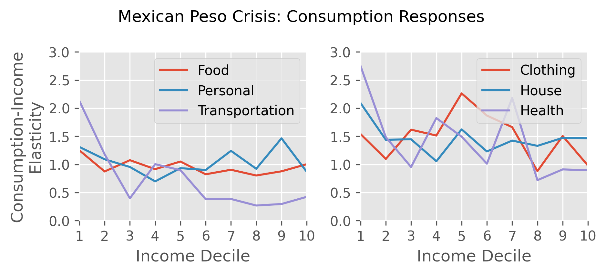
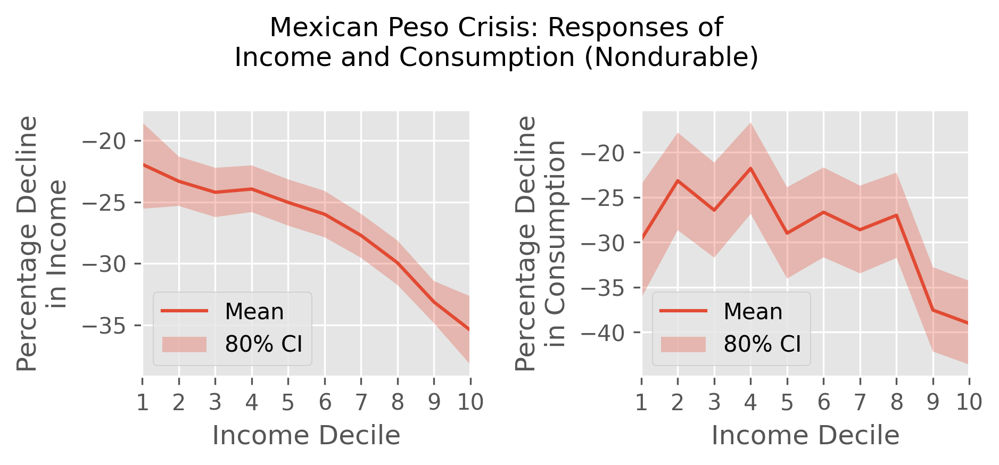

# Household Consumption
### Task
- This project studies how households change their consumption in response to a recession. 
- I study the Mexican Peso Crisis of 1994.

### Findings
- Households cut back most on clothing, housing, and health goods.
- In contrast, households cut back less on food, transportation, and personal items. 
- High income households faced larger income declines than low income households.

### Data
Mexico [National Survey of Household Income and Expenditure](https://en.www.inegi.org.mx/programas/enigh/tradicional/1994/)

### Data Wrangling
- Joined individual and household level datasets
- Merged datasets from each year
- Removed income and consumption outliers

### Methods
- Linear Regression
- Bootstrap (confidence intervals)

### Tools
- Pandas - data wrangling
- Matplotlib/seaborn - visualization
- Sklearn - linear regression
- Statsmodels - logistic regression
